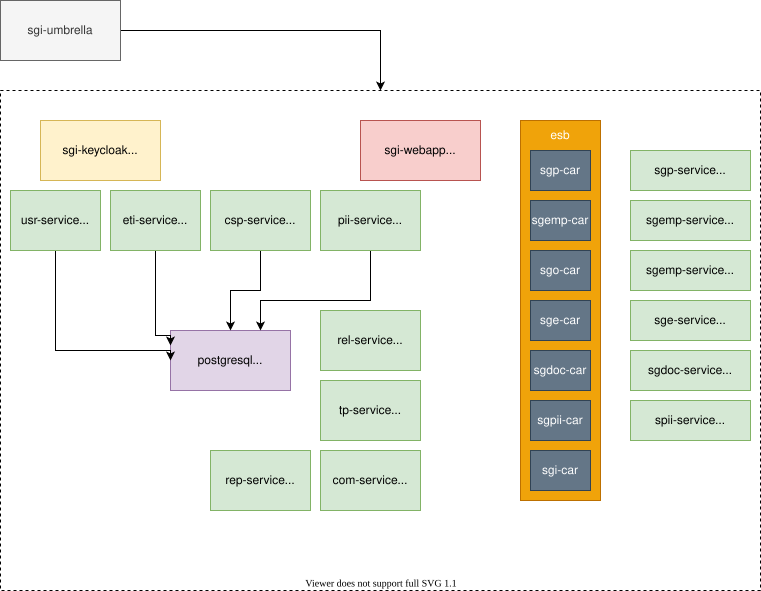

# SGI Helm Charts

[](https://helm.sh)

Este repositorio contiene los Helm charts para desplegar el [Sistema de Gestión de Investigación (SGI)](https://github.com/herculesproject/sgi), compuesto por múltiples microservicios.

El chart principal es `sgi-umbrella`, que actúa como **umbrella chart** orquestando todos los componentes del sistema.

## Estructura del repositorio



## Guía rápida de instalación

### 1. Configurar repositorios Helm

```bash
# Repositorio externo necesario
helm repo add bitnami https://charts.bitnami.com/bitnami

# Repositorio del SGI
helm repo add sgi-helm https://herculesproject.github.io/sgi-helm

# Actualizar información de repositorios
helm repo update
```

### 2. Preparar configuración

Descargar y personalizar el fichero de values para adaptarse a los requisitos del entorno.

- **Fichero de values de ejemplo:** [values.demo.yaml](https://github.com/herculesproject/sgi-helm/blob/main/config/values.demo.yaml)
- **Fichero de values por defecto del umbrella chart:** [values.yaml](https://github.com/herculesproject/sgi-helm/blob/main/charts/sgi-umbrella/values.yaml)
- **Values de cada subchart:** Consultar los valores específicos de cada componente para ver todas las opciones disponibles.

### 3. Crear namespace

```bash
kubectl create namespace sgi-demo
```

### 4. Configuración inicial del realm de Keycloak (opcional)

Para personalizar el realm de Keycloak antes del primer despliegue (secrets de clients, usuarios, roles, etc.):

1. Descargar y personalizar el realm base:
   - [sgi-realm.json](https://github.com/herculesproject/sgi/blob/main/sgi-auth/realm/sgi-realm.json)

2. Crear el ConfigMap:
   ```bash
   kubectl create configmap custom-sgi-realm \
     --from-file=sgi-realm.json=./sgi-realm.json \
     -n sgi-demo
   ```

3. Actualizar el `values.yaml` para utilizar el ConfigMap:
   ```yaml
   sgi-auth:
     realmConfigMap:
       enabled: true
       name: "custom-sgi-realm"
       key: "sgi-realm.json"
   ```

Esta configuración solo se aplica en la instalación inicial. Los cambios posteriores deben realizarse desde la interfaz de administración de Keycloak.

### 5. Instalar o actualizar el SGI

Ejemplo usando el [values.demo.yaml](https://github.com/herculesproject/sgi-helm/blob/main/config/values.demo.yaml):

```bash
helm upgrade sgi sgi-helm/sgi-umbrella \
  --install \
  --namespace sgi-demo \
  --timeout 10m0s \
  --wait \
  --wait-for-jobs \
  --create-namespace \
  -f ./config/values.demo.yaml
```

### 6. Verificar el despliegue

```bash
# Ver estado del release
helm status sgi -n <namespace>

# Listar pods
kubectl get pods -n <namespace>

# Ver logs
kubectl logs -l app.kubernetes.io/instance=sgi -n <namespace> --tail=100
```

### 7. Desinstalar el SGI

```bash
helm uninstall sgi -n sgi-demo
```


## Consultar versiones disponibles

```bash
# Todas las versiones de todos los charts
helm search repo sgi-helm --versions

# Solo la última versión del umbrella chart
helm search repo sgi-helm/sgi-umbrella
```

## Migración desde el repositorio anterior

Para realizar la migración desde el repositorio anterior (`https://hercules-sgi.github.io/sgi-helm`), actualizar la referencia al nuevo repositorio:

```bash
# Verificar repositorio actual
helm repo list
# NAME                      URL 
# sgi-helm                  https://hercules-sgi.github.io/sgi-helm/   

# Eliminar el repositorio antiguo
helm repo remove sgi-helm

# Añadir el nuevo repositorio
helm repo add sgi-helm https://herculesproject.github.io/sgi-helm

# Actualizar información de repositorios
helm repo update
```

El nuevo repositorio es totalmente compatible con instalaciones existentes. Los comandos `helm upgrade` funcionarán sin cambios adicionales.